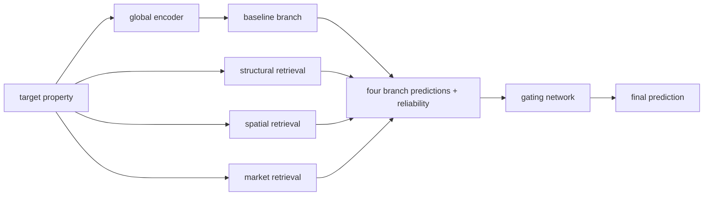

# HDB-CompNet

HDB-CompNet models Singapore Housing and Development Board resale prices with a
retrieval-augmented neural network. It combines a learned baseline estimate with
three estimates formed from historically admissible comparable transactions.

## Model idea

The model has four branches: a baseline branch using the target property's global
representation, plus structural, spatial, and market retrieval branches. Each
retrieval branch scores up to 32 train-memory candidates and predicts an
attention-weighted sum of their standardized log prices. A gating network combines
the four predictions using branch reliability and availability.



## Data

The notebook uses the Kaggle dataset
`paveleshmeev/sgp-resale-prices-90`, file
`df_common_sample_complete_case.csv`. Data, fitted artifacts, retrieval caches,
and checkpoints are deliberately excluded from Git. See [data/README.md](data/README.md).

## Refactoring status

Stages 1–2 archive the original experiment and extract its data, retrieval, model,
training, interpretation, and plotting logic into an installable package. This is
research software and is not described as production-ready. The archive contains
the original outputs; structural checks do not establish numerical equivalence to
a complete retraining run.

## Repository structure

- `src/hdb_compnet/`: maintained Python package.
- `configs/`: notebook-derived experiment configurations.
- `notebooks/archive/`: byte-preserved historical notebook.
- `docs/`: extraction inventory, mapping, and verification report.
- `data/README.md`: local data layout and credential guidance.

## Installation

Python 3.11 or 3.12 is required.

```bash
python -m pip install -e .
python -m pip install -e '.[interpretability,download]'
```

## Experiment configurations

`configs/baseline.yaml` represents the first full 30-epoch experiment.
`configs/experiment_2.yaml` represents the lower-learning-rate 60-epoch
experiment. Dataset-derived feature order and train-only category cardinalities
are recorded explicitly so that either file can construct `HDBCompNet`.
