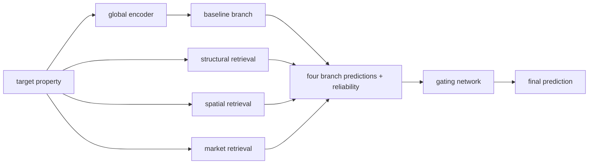

# Assessment of Price Formation Factors and Modelling of Singapore Public Resale Housing Values

### Econometric, Machine Learning and Retrieval-Augmented Neural Approaches to Singapore HDB Resale Price Modelling


## About the project

This project investigates the factors shaping apartment prices in Singapore’s public resale housing market and develops models for estimating the value of individual properties.

The study combines three directions:

1. **Econometric analysis** of housing price determinants.
2. **Comparison of classical machine learning algorithms** and econometric models.
3. **Development of HDB-CompNet**, a neural network that uses information from structural, spatial and market comparables of the target apartment.

The study considers not only the characteristics of the apartment itself, but also building attributes, location, surrounding infrastructure, mortgage restrictions and Singapore’s macroeconomic conditions.

The main objective is to build an accurate and interpretable housing price modelling system that combines statistical analysis, modern machine learning algorithms and the logic of the sales comparison approach to real estate valuation.

---

## Main tasks

The project addresses the following tasks:

- creating a unified dataset of HDB resale transactions;
- combining transactions with building characteristics and geographic coordinates;
- calculating spatial and infrastructure features;
- building a time panel of macroeconomic and mortgage indicators;
- estimating the importance of individual factors and factor groups;
- comparing econometric models, Random Forest, CatBoost and a neural network architecture;
- developing a mechanism for finding comparable historical transactions;
- interpreting predictions using SHAP, attention weights and gating weights.

---

## Data

The study is based on Housing & Development Board resale transaction data published from 1990 onward.

The prepared dataset is available through Kaggle:

```text
paveleshmeev/sgp-resale-prices-90
```

The main file containing the final sample is:

```text
df_common_sample_complete_case.csv
```

### Main sources

| Source | Use in the project |
|---|---|
| [HDB Resale Flat Prices](https://data.gov.sg/collections/189/view) | transaction prices, dates and property characteristics |
| [HDB Property Information](https://data.gov.sg/datasets/d_17f5382f26140b1fdae0ba2ef6239d2f/view) | residential building characteristics |
| [LTA MRT Station Exit](https://data.gov.sg/datasets/d_b39d3a0871985372d7e1637193335da5/view) | MRT exit coordinates |
| [MOE General Information of Schools](https://data.gov.sg/datasets/d_688b934f82c1059ed0a6993d2a829089/view) | schools and their locations |
| [NEA Hawker Centres](https://data.gov.sg/datasets/d_4a086da0a5553be1d89383cd90d07ecd/view) | hawker centre locations |
| [OneMap Singapore](https://www.onemap.gov.sg/) | address geocoding |
| [Singapore Department of Statistics](https://www.singstat.gov.sg/) | macroeconomic indicators |
| Monetary Authority of Singapore and HDB | mortgage restrictions and lending parameters |

Data and large derived artifacts are not stored in Git:

- raw and prepared tables;
- feature matrices;
- nearest-neighbour indices;
- retrieval caches;
- model checkpoints;
- outputs of individual long-running experiments.

Instructions for local data placement and Kaggle credential configuration are provided in [`data/README.md`](data/README.md).

---

## Models considered

### Econometric models

- Ordinary Least Squares regression;
- OLS with HC3 robust standard errors;
- Feasible Generalized Least Squares;
- quantile regressions for the 0.25, 0.50 and 0.75 quantiles.

The econometric specifications are used to analyse the direction, robustness and heterogeneity of factor effects.

### Classical machine learning models

- Random Forest;
- CatBoost.

These algorithms capture nonlinear relationships, feature interactions and the complex structure of tabular data.

### Neural network model

- HDB-CompNet.

HDB-CompNet combines a global representation of an apartment with information from comparable historical transactions.

---

## Modelling results

The table below presents the results on the test sample. Lower MAE and RMSE values indicate better performance, while a higher $R^2$ indicates better performance.

| Model | MAE, SGD ↓ | RMSE, SGD ↓ | $R^2$ ↑ |
|---|---:|---:|---:|
| OLS with HC3 | 36,100.51 | 49,281.84 | 0.9209 |
| FGLS with HC3 | 34,832.87 | 46,842.08 | 0.9285 |
| Quantile regression, \(q=0.25\) | 42,540.07 | 57,219.12 | 0.8933 |
| Quantile regression, \(q=0.50\) | 35,007.33 | 47,378.60 | 0.9269 |
| Quantile regression, \(q=0.75\) | 43,082.32 | 57,272.23 | 0.8931 |
| Random Forest | 14,090.81 | 20,725.31 | 0.9860 |
| **CatBoost** | **13,608.41** | **19,511.56** | **0.9876** |
| **HDB-CompNet** | **13,859.62** | **20,015.44** | **0.9869** |

CatBoost achieves the best overall predictive performance. At the same time, HDB-CompNet:

- substantially outperforms the econometric models considered;
- outperforms Random Forest in terms of MAE, RMSE and $R^2$;
- trails CatBoost by approximately 1.8% in MAE and 2.6% in RMSE;
- provides additional interpretability through retrieved comparables, attention weights and branch-specific weights.

The proposed neural architecture therefore achieves performance close to one of the strongest algorithms for tabular data while retaining a direct connection to the domain logic of real estate valuation.

---

## Most important factors

A comparison of the econometric models, machine learning algorithms and HDB-CompNet identifies the following consistently important indicators:

1. apartment floor area;
2. apartment type;
3. remaining lease term;
4. distance to Raffles Place;
5. Consumer Price Index;
6. household net worth;
7. number of households living in HDB housing;
8. real GDP per capita;
9. HDB Mortgage Servicing Ratio;
10. town in which the apartment is located.

In HDB-CompNet, apartment floor area, the Consumer Price Index and household net worth have the highest global SHAP importance.

SHAP values are used to interpret model predictions and are not treated as estimates of causal effects on housing prices.

---

# HDB-CompNet

## Main idea

A conventional neural network produces a prediction using only the characteristics of the target property. HDB-CompNet supplements this prediction with information from actual historical transactions.

For each apartment, the model considers four sources of valuation:

1. **Baseline branch** — a prediction based on the complete feature set of the target property.
2. **Structural branch** — a prediction based on apartments with similar physical characteristics.
3. **Spatial branch** — a prediction based on properties with similar locations and surrounding infrastructure.
4. **Market branch** — a prediction based on transactions completed under similar market and macroeconomic conditions.

The outputs of the four branches are combined by a trainable gating network.



---

## HDB-CompNet workflow

### 1. Global property representation

Numerical features are combined with trainable embeddings of categorical features.

The resulting vector is passed to the `GlobalPropertyEncoder`, which creates a shared hidden representation of the target apartment.

The baseline branch uses this representation to produce an independent neural network prediction.

### 2. ReferenceMemory

Historical transactions from the training sample are stored in an immutable `ReferenceMemory`.

The memory contains:

- property features;
- categorical indices;
- transaction dates;
- apartment types and floor areas;
- standardized logarithmic prices;
- property representations in the three retrieval spaces.

Validation and test observations are not included in the memory.

### 3. Initial neighbour search

For every property, the neighbour search is performed separately in three spaces:

- structural;
- spatial;
- market.

Indices are built separately for each apartment type. This prevents comparisons between properties belonging to fundamentally different market segments.

At the first stage, up to 128 nearest transactions are retrieved for every target transaction using Euclidean distance in the corresponding normalized feature space.

### 4. Selection of admissible comparables

After the initial search, additional restrictions are applied:

- a comparable cannot be the target transaction itself;
- the comparable transaction must have occurred before the target transaction;
- the apartment type must match;
- floor area must fall within an admissible range;
- if an insufficient number of properties is available, the floor-area range is expanded sequentially.

After filtering, up to 32 final comparables are retained for each retrieval branch.

### 5. Candidate relevance scoring

Each branch uses separate target and candidate encoders.

For every target-property and historical-comparable pair, the model constructs similarity features that include:

- hidden property representations;
- retrieval distance;
- time gap;
- differences between property characteristics;
- interaction features between the target property and the comparable.

The `PairwiseScoreNetwork` calculates the candidate’s base score.

A trainable recency penalty is then applied: an older comparable may receive a lower weight when the model determines that the time gap is relevant.

### 6. Attention-based price aggregation

The scores of admissible comparables are converted into attention weights using masked softmax.

A retrieval branch prediction is formed as a weighted sum of the observed standardized logarithmic prices of the comparables:

$\widehat{y}^{(b)} = \sum_{j=1}^{K} \alpha_{j}^{(b)} y_j$,

where:

- $b$ denotes the structural, spatial or market branch;
- $K$ is the number of available candidates;
- $\alpha_j^{(b)}$ is the trainable attention weight;
- $y_j$ is the historical comparable’s price in the target-variable space.

In the current version, the model does not adjust the price of each comparable with a separate residual network: the retrieval branches aggregate the actually observed transaction prices.

### 7. Branch reliability estimation

Additional reliability indicators are calculated for every retrieval branch:

- number of available comparables;
- average retrieval distance;
- average transaction time gap;
- concentration of attention weights;
- branch availability.

These indicators allow the gating network to consider both the prediction of a branch and the quality of the comparable set on which it is based.

### 8. Gating network

The gating network receives:

- the global apartment representation;
- predictions from the four branches;
- reliability features;
- availability masks.

Masked softmax produces the following weights:

$$
g_{\mathrm{base}},
\quad
g_{\mathrm{structural}},
\quad
g_{\mathrm{spatial}},
\quad
g_{\mathrm{market}}.
$$

The final prediction is $`\widehat{y}
=
g_{\mathrm{base}}\widehat{y}_{\mathrm{base}}
+
g_{\mathrm{structural}}\widehat{y}_{\mathrm{structural}}
+
g_{\mathrm{spatial}}\widehat{y}_{\mathrm{spatial}}
+
g_{\mathrm{market}}\widehat{y}_{\mathrm{market}}`$.

Unavailable retrieval branches receive zero weight. The baseline branch remains available for every property.

The prediction is then transformed from the standardized logarithmic space back into Singapore dollars.

---

## HDB-CompNet training

The model is trained using the main Huber loss for the final prediction and auxiliary losses for the individual branches:

$L = L_{\mathrm{main}} + \lambda L_{\mathrm{aux}}$.

Auxiliary losses are applied only to available retrieval branches and help each branch produce a meaningful standalone prediction.

The training procedure uses:

- Adam;
- mixed precision;
- gradient clipping;
- `ReduceLROnPlateau`;
- early stopping;
- best-checkpoint selection based on validation main loss;
- MAE, RMSE and $R^2$ evaluation in standardized, logarithmic and original price scales.

---

## Experimental notebooks

### `econ-diploma-models-v0(3).ipynb`

Contains the main research component of the project:

- data preparation and analysis;
- testing of research hypotheses;
- econometric specifications;
- quantile regressions;
- Random Forest;
- CatBoost;
- evaluation metrics;
- factor-importance analysis;
- model comparison.

### `notebooks/archive/HDB_CompNet_original.ipynb`

Contains the complete HDB-CompNet experiment:

- neural network feature preparation;
- `ReferenceMemory` construction;
- retrieval-space creation;
- historical-comparable search and filtering;
- cache construction;
- implementation of architectural components;
- training and validation;
- checkpointing;
- test evaluation;
- gating-weight analysis;
- retrieval-branch analysis;
- SHAP interpretation.

---

## Main directory responsibilities

| Directory | Contents |
|---|---|
| `configs/` | parameters of the HDB-CompNet experiments |
| `data/` | instructions for obtaining and placing the data |
| `notebooks/` | complete experimental notebook for the neural network model |
| `src/hdb_compnet/data/` | data preparation, retrieval, caches and DataLoader |
| `src/hdb_compnet/model/` | HDB-CompNet architecture |
| `src/hdb_compnet/training/` | loss functions, training, metrics and checkpoints |
| `src/hdb_compnet/interpretability/` | SHAP and branch analysis |
| `src/hdb_compnet/visualization/` | training and interpretation plots |

---

## Experiment configurations

The `configs/` directory contains parameters for the two main HDB-CompNet experiments.

### `baseline.yaml`

The first complete configuration:

- 30 epochs;
- baseline architectural parameters;
- initial learning rate;
- initial auxiliary-loss weight.

### `experiment_2.yaml`

The improved configuration:

- up to 60 epochs;
- lower learning rate;
- modified regularization;
- reduced auxiliary-loss weight;
- increased early-stopping patience.

The second configuration produces the final result:

```text
MAE = 13,859.62 SGD
RMSE = 20,015.44 SGD
R2 = 0.9869
```

---

## Installation

Python 3.11 and 3.12 are supported.

```bash
git clone https://github.com/eshmeevpv/jmlc_project.git
cd jmlc_project
```

Create a virtual environment:

```bash
python -m venv .venv
```

Linux/macOS:

```bash
source .venv/bin/activate
```

Windows:

```powershell
.venv\Scripts\activate
```

Install the main package:

```bash
python -m pip install --upgrade pip
python -m pip install -e .
```

Install dependencies for data downloading and model interpretation:

```bash
python -m pip install -e '.[interpretability,download]'
```

---

## Data access

To download data from Kaggle, set the following environment variables:

```bash
export KAGGLE_USERNAME='your_username'
export KAGGLE_KEY='your_key'
```

For Windows PowerShell:

```powershell
$env:KAGGLE_USERNAME='your_username'
$env:KAGGLE_KEY='your_key'
```

Actual credentials must not be stored in Git.

The detailed local directory structure is described in [`data/README.md`](data/README.md).
